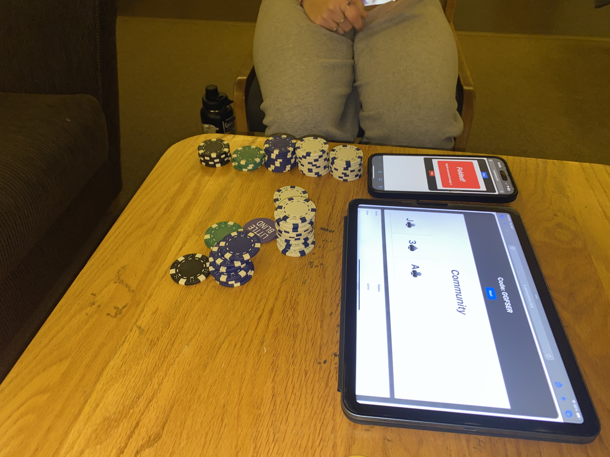

# *pokerparty!*
## by Ryder Pham and Krishna Katakota

### Instructions for running locally
* clone repo
* clone [backend repo](https://github.com/krishnakatakota/pokerparty-ws-server) and run that according to its readme's instructions
* run `npm install`
* run `ng serve`

Playtesting demo January 7, 2025:

Prototype as of June 18, 2024:

Legacy repo [here](https://github.com/havesomepham/pokerparty)
